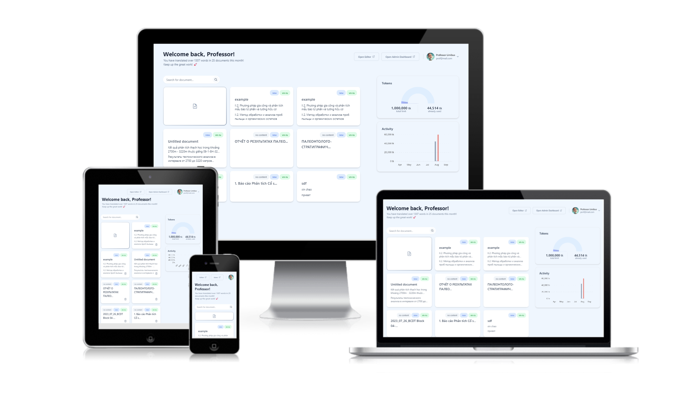
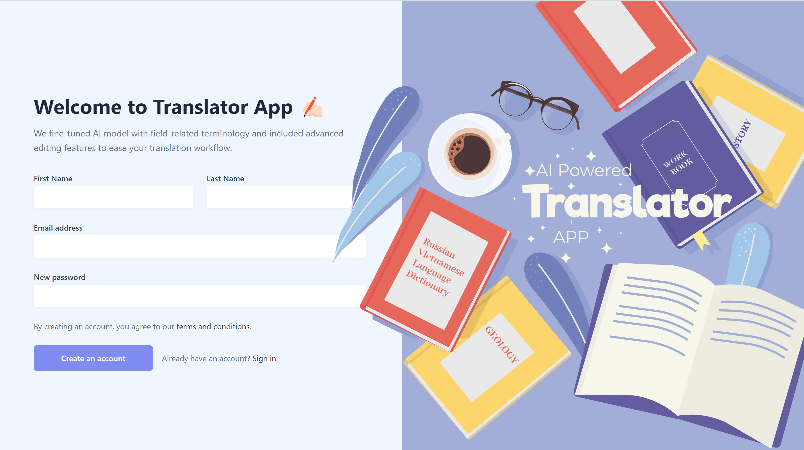
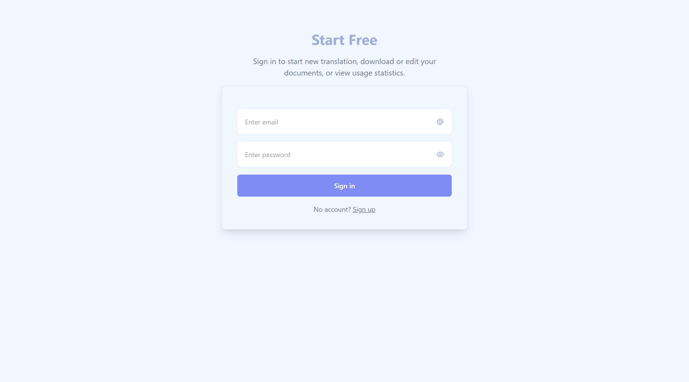
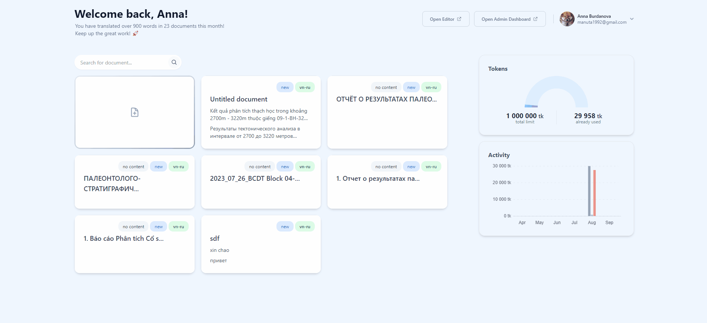
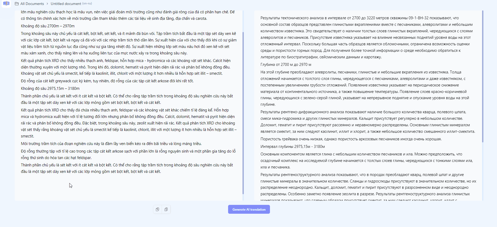
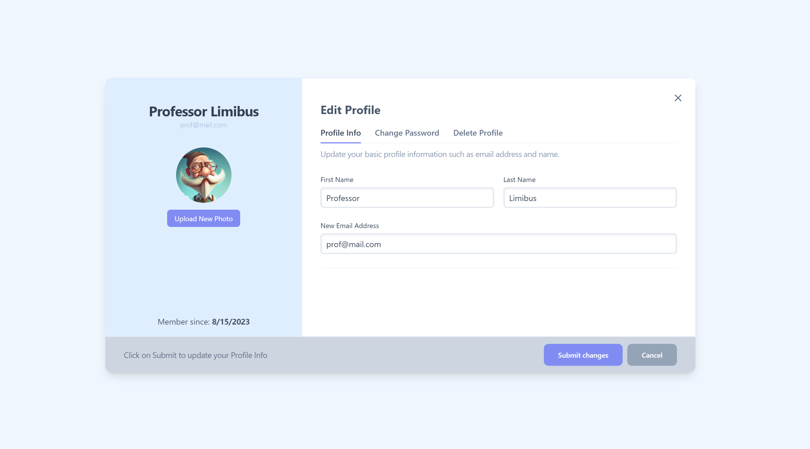
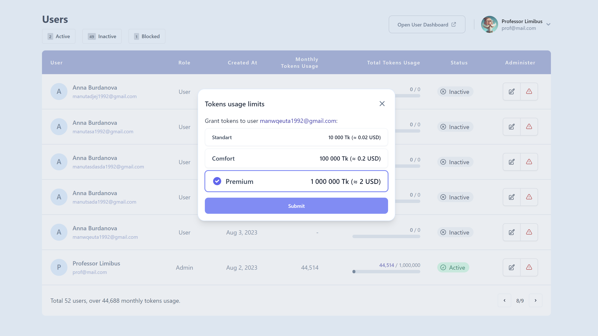

#  Translator AI App

> Empowered by advanced AI model APIs (Open AI / Azure), this application facilitates seamless translations of technical documentation based on context.

[](https://app.netlify.com/sites/translator-app-ts-front/deploys)

The translator app is an essential tool for businesses that require accurate translations of technical documentation. While popular text translation tools like Google Translate and commercial deep-learning-based solutions are effective for common communication topics, they often fall short when it comes to less commonly used languages or highly specialized terminology.

For instance, the bi-lingual international company the application was initially designed for requires all technical documents to be provided in both Russian and Vietnamese languages. Unfortunately, existing translation tools frequently produce unreadable gibberish due to the narrow-field terminology involved. This results in a significant amount of manual labor being required on what should otherwise be an automatable task.

To address this issue, we have developed an AI-powered application designed specifically for enhancing the accuracy of translations by utilizing private databases with pre-existing samples from various fields and industries. By doing so, we can significantly improve efficiency while also reducing costs associated with manual corrections - ultimately providing better quality service overall!

[**View Live** _(\* might requre a few minutes to warm up server)_](https://translatorai.tech/ "Translator App")

## Key Features

- Mobile-first responsive design and animations


&nbsp;

- JWT-based secure authentication to protect sensitive data



&nbsp;

- Effortless work with documents and monitoring of usage statistics


&nbsp;

- One-click translation experience, extremely straightforward and user-friendly


&nbsp;

- Translation of .docx documents without losses in formatting or structure


&nbsp;

- User profile management


&nbsp;

- Simple role-based administration


&nbsp;

## Designed and Build with


## Roadmap

- [ ] Night Theme
- [ ] Accessibility
- [ ] Multi-language UI Support
  - [ ] Vietnamese
  - [ ] Russian
- [ ] Undo/Redo Editor Functionality

## Installation

Linux & Windows:

```bash
npm install     # Install dependencies
npm run build   # Build production version
npm run dev     # Run in development mode
```

This will run the frontend (client) part of the application, the backend (api) is [here](https://github.com/AnnaBurd/translator-app-ts-api)

## Contributing

1. Fork project (<https://github.com/annaburd/translator-app-ts-front/fork>)
2. Create your feature branch (`git checkout -b feature/fooBar`)
3. Commit your changes (`git commit -am 'Add some fooBar'`)
4. Push to the branch (`git push origin feature/fooBar`)
5. Create a new Pull Request

## Support

<a href="https://github.com/annaburd/translator-app-ts-front/issues">Report Bug</a>
·
<a href="https://www.linkedin.com/in/anna-burdanova-b91453218/">Discuss Issues</a>

